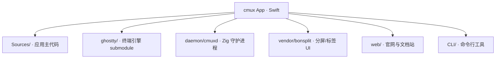

# Teamwork Space

> 本文件是 cmux 项目的 teamwork 全景入口。轻量初始化版本：单子项目模式。
> 🔴 本文件的任何变更都需要用户明确确认后才能生效。

---

## 规划状态

| 字段 | 值 |
|------|---|
| 状态 | ✅ 正常 |
| 当前阶段 | 开发中（成熟项目接入 teamwork） |
| 最近规划 | 2026-04-14 轻量初始化 |
| 受影响子项目 | cmux |

---

## 项目架构全景

cmux 是 macOS 原生应用（Swift + AppKit/SwiftUI），内嵌 Ghostty 终端。单体架构，按模块分层。



---

## 项目目录结构

```
cmux-pro/
├── teamwork_space.md         # 本文件
├── CLAUDE.md                 # 项目开发规范（权威约束来源）
├── Sources/                  # Swift 应用主代码（AppKit + SwiftUI + Ghostty 集成）
├── Resources/                # 资源（Info.plist、Localizable.xcstrings、图标等）
├── ghostty/                  # submodule: 终端引擎（manaflow-ai/ghostty fork）
├── daemon/                   # Zig 守护进程（cmuxd）
├── vendor/bonsplit/          # 分屏/标签 UI 库（含 DebugEventLog）
├── web/                      # 官网 + 文档（Next.js）
├── CLI/                      # 命令行工具（cmux CLI）
├── cmuxTests/                # 单元测试
├── cmuxUITests/              # UI 测试
├── tests_v2/                 # Python socket 集成测试
├── scripts/                  # 构建/发布脚本（reload.sh/release.sh 等）
├── docs/                     # 全局文档
└── design/                   # 设计稿/资源
```

---

## 子项目清单

| 缩写 | 名称 | 类型 | 职责范围 | 技术栈 | 需要 UI | 完成度 | 项目详情 |
|------|------|------|----------|--------|---------|--------|----------|
| CMUX | cmux macOS App | business | 负责：完整 macOS 终端工作区应用（终端、分屏、工作区、设置、CLI、守护进程）。不负责：三方终端引擎内部实现（委托 ghostty submodule） | Swift / AppKit / SwiftUI / Zig / Next.js | 是 | 0/0 | — |

> 单子项目模式：所有 Feature 归属 CMUX。如未来拆分（如 web 官网独立、CLI 独立版本线），再升级为多子项目模式。

---

## 跨项目需求追踪

> 单子项目模式下暂不使用。升级为多子项目后启用。

---

## 变更记录

| 日期 | 变更类型 | 变更内容 | 确认状态 |
|------|----------|----------|----------|
| 2026-04-14 | 初始化 | PMO 轻量骨架（单子项目 CMUX），基于 CLAUDE.md 与根目录扫描生成 | ✅ 已确认 |
